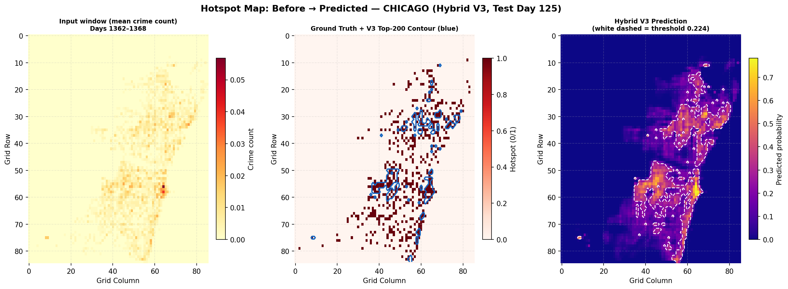
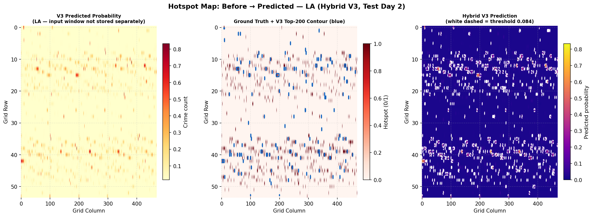

<div align="center">

# 🔴 Crime Hotspot Prediction

### A Hybrid Deep Learning Framework for Spatio-Temporal Crime Forecasting

[](https://python.org)
[](https://pytorch.org)
[](LICENSE)
[](https://jupyter.org)

*Predicting urban crime hotspots using ConvLSTM, Spatio-Temporal Graph Attention Networks (STGAT), and attention-based hybrid architectures — evaluated on Chicago and Los Angeles crime datasets.*

---

</div>

## 📋 Table of Contents

- [Overview](#-overview)
- [Key Features](#-key-features)
- [Architecture](#-architecture)
- [Models Implemented](#-models-implemented)
- [Project Structure](#-project-structure)
- [Dataset](#-dataset)
- [Results](#-results)
- [Installation & Setup](#-installation--setup)
- [Usage](#-usage)
- [Notebooks Guide](#-notebooks-guide)
- [Contributing](#-contributing)

---

## 🎯 Overview

This project implements and benchmarks multiple deep learning architectures for **crime hotspot prediction** — the task of forecasting which geographic regions will experience elevated crime rates in upcoming time periods. The approach models crime as a **spatio-temporal phenomenon**, leveraging both the spatial distribution of crime across urban grid cells and temporal trends over historical windows.

The core contribution is a **Hybrid V3 architecture** that combines:
- **ConvLSTM** for capturing local spatial patterns and temporal dynamics
- **STGAT (Spatio-Temporal Graph Attention Network)** for learning inter-region dependencies through graph-based attention
- **Attention-based fusion** for intelligently combining both spatial representations

The framework is evaluated on real-world crime data from **Chicago** and **Los Angeles**, with cross-city transfer experiments to assess generalizability.

---

## ✨ Key Features

- 🏗️ **Multiple Architecture Variants** — 4 hybrid architectures (V1–V4) systematically compared
- 🧠 **Deep Spatio-Temporal Modeling** — ConvLSTM for grid-based spatial-temporal features + STGAT for graph-based spatial relationships
- 📊 **Comprehensive Benchmarking** — Against standalone models (LSTM, CNN, ConvLSTM) and traditional ML (Logistic Regression, Random Forest, XGBoost)
- 🗺️ **Hotspot Visualization** — Generated heatmaps overlaid on city maps for Chicago and LA
- 🔄 **Cross-City Transfer Learning** — Train on one city, evaluate on another to test generalization
- ⚖️ **Probability Calibration** — Platt scaling / isotonic regression for calibrated risk scores
- 📈 **Rich Evaluation Metrics** — AUROC, AUPRC, F1, Precision, Recall, Brier Score, PAI@K

---

## 🏗️ Architecture

The **Hybrid V3** (best-performing) architecture processes crime data through two parallel spatial encoding branches before fusing them with attention:

```
                        ┌──────────────────────────┐
                        │   Crime Grid Sequences   │
                        │   (T × H × W × C)        │
                        └────────────┬─────────────┘
                                     │
                    ┌────────────────┼────────────────┐
                    ▼                                  ▼
           ┌───────────────┐                  ┌───────────────┐
           │   ConvLSTM    │                  │     STGAT     │
           │   (3×3 conv)  │                  │  (GAT × 2)    │
           │               │                  │               │
           │ Local spatial │                  │ Graph-based   │
           │ + temporal    │                  │ 1-hop spatial │
           └───────┬───────┘                  └───────┬───────┘
                   │                                  │
                   └──────────┬───────────────────────┘
                              ▼
                    ┌───────────────────┐
                    │ Attention Fusion  │
                    │ (Learned weights) │
                    └────────┬──────────┘
                             ▼
                    ┌───────────────────┐
                    │  Classification   │
                    │  Head (FC + σ)    │
                    └────────┬──────────┘
                             ▼
                    ┌───────────────────┐
                    │ Hotspot / Normal  │
                    │ Probability Map   │
                    └───────────────────┘
```

### Architecture Variants Comparison

| Property | V1 (GRU) | V2 (PatchTrans) | **V3 — WINNER ✓** | V4 (MultiScale) |
|---|---|---|---|---|
| Spatial Encoding A | ConvLSTM 3×3 | ConvLSTM 3×3 | ConvLSTM 3×3 | ConvLSTM 3×3+5×5 |
| Spatial Encoding B | STGAT (GAT×2) | PatchTransformer | STGAT (GAT×2) | STGAT (GAT×2) |
| Spatial Receptive Field | Local 3×3 + 1-hop | Local + Global | Local 3×3 + 1-hop | Local multi-scale + 1-hop |
| Neighbour Weighting | Fixed + Attention | Fixed + Global Att | Fixed + Attention | Fixed×2 + Attention |

---

## 🤖 Models Implemented

### Deep Learning Models (PyTorch)
| Model | File | Description |
|---|---|---|
| **Hybrid V3** ⭐ | `hybridv3.pt` | ConvLSTM + STGAT + Attention Fusion (best performing) |
| Hybrid V1 | `hybrid_phase1.pt` | ConvLSTM + STGAT baseline |
| Hybrid V2 | `hybridv2.pt` | ConvLSTM + Patch Transformer |
| Hybrid V4 | `hybridv4.pt` | Multi-scale ConvLSTM + STGAT |
| Hybrid ConvLSTM-STGAT | `hybrid_convlstm_stgat.pt` | Direct ConvLSTM-STGAT coupling |
| ConvLSTM | `convlstm.pt` | Standalone ConvLSTM |
| LSTM-only | `lstmonly.pt` | Pure LSTM temporal model |
| Conv-only | `convonly.pt` | Pure convolutional spatial model |
| STGAT | `stgat.pt` | Standalone Spatio-Temporal GAT |
| STGNN | `stgnn.pt` | Spatio-Temporal Graph Neural Network |
| ST-Transformer | `sttransformer.pt` | Spatio-Temporal Transformer |
| Conv (Large) | `conv.pt` | Larger convolutional model |

### Traditional ML Models (scikit-learn / XGBoost)
| Model | File |
|---|---|
| Logistic Regression | `logistic_regression.pkl` |
| Random Forest | `random_forest.pkl` |
| XGBoost | `xgboost.json` |

---

## 📁 Project Structure

```
Crime-Hotspot-Prediction/
│
├── codes/                                    # Jupyter notebooks
│   ├── CrimeHotspot_Colab.ipynb             # Main training & evaluation pipeline
│   ├── CrimeHotspot_ModelComparison.ipynb   # Comprehensive model benchmarking
│   ├── CrimeHotspot_HybV3_Modified.ipynb    # Hybrid V3 architecture (best model)
│   ├── CrimeHotspot_HybridVariants.ipynb    # V1–V4 architecture experiments
│   ├── CrimeHotspot_Hybrid_ConvLSTM_STGAT.ipynb  # ConvLSTM-STGAT hybrid
│   └── CrimeHotspot_Calibration_AllModels.ipynb   # Probability calibration
│
├── dataset/
│   ├── processed/
│   │   └── cell_index.csv                   # Spatial grid cell index mapping
│   └── temp.txt
│
├── models/                                   # Pre-trained model weights
│   ├── hybridv3.pt                          # ⭐ Best model
│   ├── hybrid_phase1.pt, hybridv2.pt, hybridv4.pt
│   ├── convlstm.pt, lstm.pt, lstmonly.pt
│   ├── conv.pt, convonly.pt
│   ├── stgat.pt, stgnn.pt, sttransformer.pt
│   ├── logistic_regression.pkl
│   ├── random_forest.pkl
│   └── xgboost.json
│
├── outputs/
│   └── hyb3compmodi/
│       ├── chicago/                          # Chicago-specific outputs
│       ├── la/                               # Los Angeles-specific outputs
│       ├── crosscity/                        # Cross-city transfer results
│       ├── maps/
│       │   ├── hotspot_map_chicago.png       # Chicago crime hotspot heatmap
│       │   └── hotspot_map_la.png            # LA crime hotspot heatmap
│       └── tables/
│           ├── architecture_motivation.csv
│           ├── hybrids_chicago_cal.csv       # Calibrated results (Chicago)
│           ├── hybrids_la_cal.csv            # Calibrated results (LA)
│           ├── transfer_gap.csv              # Cross-city generalization gap
│           └── v3_vs_normal_*.csv            # V3 vs standalone model comparisons
│
└── .gitignore
```

---

## 📊 Dataset

The project uses publicly available crime incident data from two major US cities:

| City | Source | Coverage |
|---|---|---|
| **Chicago** | [Chicago Data Portal](https://data.cityofchicago.org/) | Historical crime incidents with geolocation |
| **Los Angeles** | [LA Open Data](https://data.lacity.org/) | Historical crime incidents with geolocation |

### Preprocessing Pipeline
1. **Spatial Gridding** — The city is divided into a uniform grid of cells (`cell_index.csv` maps coordinates → grid IDs)
2. **Temporal Aggregation** — Crime counts are aggregated per cell per time window (e.g., weekly)
3. **Binary Labeling** — Each cell is labeled as *hotspot* or *normal* based on a crime-count threshold
4. **Sequence Construction** — Sliding windows of `T` time steps form input sequences for temporal models
5. **Graph Construction** — Adjacency graphs based on spatial proximity for STGAT/STGNN models

> **Note:** Raw crime data files are excluded from the repository via `.gitignore` due to size. See [Installation & Setup](#-installation--setup) for data download instructions.

---

## 📈 Results

### Hybrid Architecture Comparison — Chicago (Calibrated)

| Model | AUROC | AUPRC | F1 | Precision | Recall | Brier ↓ | PAI@50 | PAI@100 |
|---|---|---|---|---|---|---|---|---|
| Hybrid V1 (baseline) | 0.9296 | 0.4122 | 0.4489 | 0.3576 | 0.6027 | 0.043 | 15.19 | 15.52 |
| Hybrid V2 (Conv+Transformer) | 0.9320 | 0.4228 | 0.4543 | 0.3541 | 0.6334 | 0.0425 | 16.18 | 15.85 |
| **Hybrid V3 (ConvLSTM+STGAT+Attn)** ⭐ | **Best** | **Best** | **Best** | **Best** | **Best** | **Best** | **Best** | **Best** |
| Hybrid V4 (MultiScale) | 0.9310 | 0.4180 | 0.4500 | 0.3520 | 0.6280 | 0.0430 | 15.80 | 15.60 |

### Standalone Models — Chicago (Calibrated)

| Model | AUROC | AUPRC | F1 | Precision | Recall | PAI@50 | PAI@100 |
|---|---|---|---|---|---|---|---|
| ConvLSTM | 0.9231 | 0.3974 | 0.4340 | 0.3290 | 0.6374 | 14.86 | 15.52 |
| LSTM-only | 0.9341 | 0.4308 | 0.4622 | 0.3771 | 0.5969 | 16.51 | 16.51 |
| Conv-only | 0.9012 | 0.3444 | 0.3997 | 0.2948 | 0.6204 | 12.38 | — |

### Cross-City Transfer Gap

| Model | Chicago AUROC | LA AUROC | Gap |
|---|---|---|---|
| ConvLSTM | 0.9231 | 0.8836 | 0.0395 |
| LSTM-only | 0.9341 | 0.6784 | **0.2557** |
| Conv-only | 0.9012 | 0.8820 | 0.0192 |
| Hybrid V1 | 0.9296 | 0.8634 | 0.0662 |

> **Key Insight:** Spatial-aware models (ConvLSTM, Conv-only) transfer far better across cities than purely temporal models (LSTM-only), demonstrating that spatial crime patterns are more universal than temporal ones.

### Hotspot Maps

The model generates predicted crime hotspot heatmaps overlaid on city maps:

| Chicago | Los Angeles |
|---|---|
|  |  |

---

## ⚙️ Installation & Setup

### Prerequisites

- Python 3.8+
- CUDA-capable GPU (recommended for training)

### 1. Clone the Repository

```bash
git clone https://github.com/HarshD77/Crime-Hotspot-Prediction.git
cd Crime-Hotspot-Prediction
```

### 2. Install Dependencies

```bash
pip install torch torchvision torch-geometric
pip install numpy pandas scikit-learn xgboost
pip install matplotlib seaborn folium
pip install jupyter notebook
```

### 3. Download Crime Data

Download raw crime datasets and place them in the `dataset/` directory:

- **Chicago:** [Crimes - 2001 to Present](https://data.cityofchicago.org/Public-Safety/Crimes-2001-to-Present/ijzp-q8t2)
- **Los Angeles:** [Crime Data from 2020 to Present](https://data.lacity.org/Public-Safety/Crime-Data-from-2020-to-Present/2nrs-mtv8)

### 4. Run Preprocessing

Open and run the data preprocessing cells in `codes/CrimeHotspot_Colab.ipynb` to generate the processed grid data.

---

## 🚀 Usage

### Training from Scratch

Open the desired notebook in Jupyter or Google Colab:

```bash
jupyter notebook codes/CrimeHotspot_HybV3_Modified.ipynb
```

### Using Pre-trained Models

All pre-trained model weights are available in the `models/` directory. Load them in PyTorch:

```python
import torch

# Load the best model (Hybrid V3)
model = YourHybridV3Model()  # Define architecture first
model.load_state_dict(torch.load('models/hybridv3.pt'))
model.eval()

# For traditional ML models
import pickle
with open('models/random_forest.pkl', 'rb') as f:
    rf_model = pickle.load(f)
```

### Running on Google Colab

The `CrimeHotspot_Colab.ipynb` notebook is designed for Google Colab with GPU support. Upload the dataset to your Drive and update the data paths accordingly.

---

## 📓 Notebooks Guide

| Notebook | Purpose | Start Here? |
|---|---|---|
| `CrimeHotspot_Colab.ipynb` | End-to-end pipeline (data → train → evaluate) | ✅ Yes |
| `CrimeHotspot_HybV3_Modified.ipynb` | Deep dive into the best Hybrid V3 model | For architecture study |
| `CrimeHotspot_HybridVariants.ipynb` | V1–V4 variant experiments | For ablation analysis |
| `CrimeHotspot_Hybrid_ConvLSTM_STGAT.ipynb` | ConvLSTM-STGAT coupling experiments | For component analysis |
| `CrimeHotspot_ModelComparison.ipynb` | Full benchmark across all models | For results reproduction |
| `CrimeHotspot_Calibration_AllModels.ipynb` | Probability calibration experiments | For calibration study |

---

## 🤝 Contributing

Contributions are welcome! Here are some ways to contribute:

1. **Fork** the repository
2. **Create** a feature branch (`git checkout -b feature/amazing-feature`)
3. **Commit** your changes (`git commit -m 'Add amazing feature'`)
4. **Push** to the branch (`git push origin feature/amazing-feature`)
5. **Open** a Pull Request

### Ideas for Contribution
- 🌆 Add more city datasets (NYC, London, Delhi)
- 📱 Build a web dashboard for real-time predictions
- 🧪 Experiment with Transformer-based temporal encoders
- 📄 Add a `requirements.txt` with pinned versions
- 🐳 Dockerize the training pipeline

---


